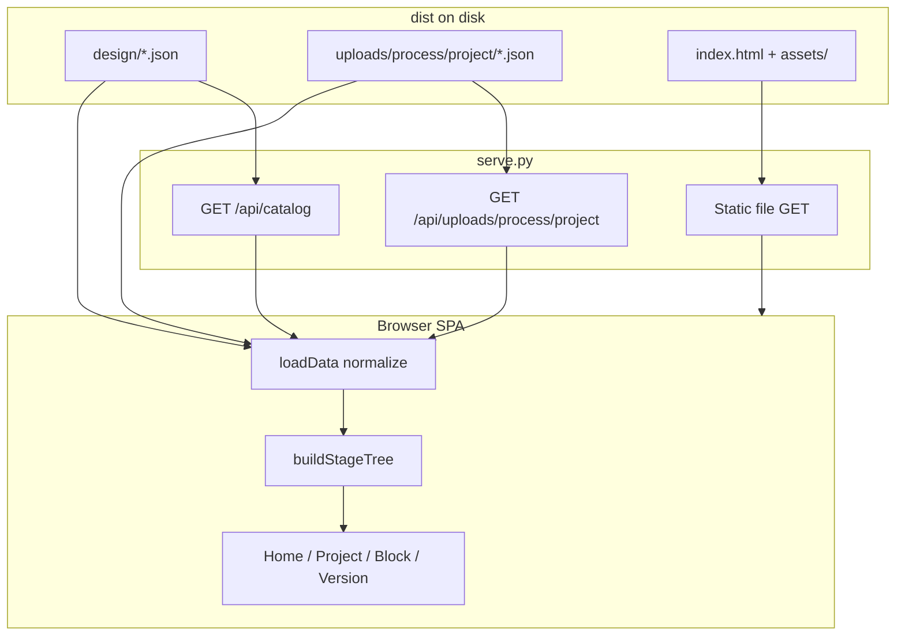

# APR Common Dashboard

Read-only web dashboard for APR / ECO / SignOff data produced by SQMS uploads. Drop hierarchy and upload JSON into `dist/`, start a tiny Python server, browse process → project → block → version.

---

## 1. Can I zip a built `apr_dashboard` and run it on Linux without rebuilding?

**Yes — if** `dist/` **already contains the Vite build output.**

On the Linux host you only need **Python 3.9+** (stdlib). You do **not** need Node.js at runtime.

```bash
# After unzip
cd apr_dashboard
python3 serve.py --dir dist --port 8080
# Open http://127.0.0.1:8080/
```

Minimum tree that must be present:

```
apr_dashboard/
  serve.py                 # required
  dist/
    index.html             # Vite build
    assets/                # hashed JS/CSS from Vite
    design/*.json                          # hierarchy (home cards)
    uploads/<process>/<project>/*.json     # SQMS uploads, loaded when opening that project card
```


| Needed to **serve**  | Needed to **rebuild** UI  |
| -------------------- | ------------------------- |
| Python 3.9+          | Node.js 22 + npm          |
| `serve.py` + `dist/` | `package.json`, `src/`, … |


You can omit `node_modules/` from the zip (large and unused at runtime). Keep `dist/design` and `dist/uploads` — that is the live data.

---


## 2. Framework overview


### What it is

A **static SPA + file-backed catalog**:

- **Frontend:** Vite + React + TypeScript shell; dashboard logic lives in `src/legacy/dashboard.js` (hash router, normalize JSON, father trees, HTML views).
- **Backend:** `serve.py` — stdlib HTTP server that (1) serves files from `dist/`, (2) exposes `GET /api/catalog` (design filenames for home cards), and (3) exposes `GET /api/uploads/<process>/<project>` (JSON filenames in that folder only).
- **Data:** plain JSON files on disk. No database, no auth, no write API.




### Directory map

```
apr_dashboard/
  src/                 # edit here (React + dashboard logic + CSS)
  dist/                # runtime root: build output + JSON data
  serve.py             # production/dev static + catalog server
  build.py             # npm/Vite build (preserves design/uploads)
  package.json         # Node 22 toolchain
  scripts/             # linux readiness, port helpers
  doc/                 # function reference and data model
  other_tools/         # offline demo generators
```


### Request flow (first page load)

1. Browser loads `/` → `index.html` + JS/CSS under `/assets/`.
2. Home: SPA calls `GET /api/catalog` → `{ design: [...] }` and fetches each `design/<encoded>` to build process/project cards. Upload JSON is **not** read here.
3. Opening a project card (`#/project/<process>_<project>`) calls `GET /api/uploads/<process>/<project>` and fetches only `uploads/<process>/<project>/<encoded>.json` (see `uploadJsonUrl` / `designJsonUrl` — filenames often contain `%`).
4. Those uploads are normalized for that project; father trees for APR/ECO are built entirely in the browser.


### UI navigation


| Route                                         | Purpose                                            |
| --------------------------------------------- | -------------------------------------------------- |
| `#/`                                          | Cards for each `PROCESS_PROJECT`                   |
| `#/project/<id>`                              | Design hierarchy + SignOff / APR / ECO leaf counts |
| `#/project/<id>/block/<block>/signoff`        | Latest `stage_qa` checklist                        |
| `#/project/<id>/block/<block>/apr` (or `eco`) | Leaf uploads in the father tree                    |
| `.../version/<nodeId>`                        | Lineage path + side-by-side metric tables          |


Enabled stages: **APR**, **ECO**, **SignOff**. PV / STA / IR / Summary are UI placeholders.

### Data contracts (short)

- **Design file** `N4_SM8466.json` → process `N4`, project `SM8466`; nested `subblocks` tree.
- **Upload file** `uploads/N4/SM8466/*.json` (folder matches the design card) → metadata + `item.*` metrics; optional `father`; `stage_qa` feeds SignOff. Home does not scan other projects' folders.
- Full shapes: [apr_dashboard/doc/DATA_MODEL.md](apr_dashboard/doc/DATA_MODEL.md).


### Build vs serve


| Command                                   | When                                           |
| ----------------------------------------- | ---------------------------------------------- |
| `npm ci && python3 build.py`              | After changing `src/` (needs Node 22)          |
| `python3 serve.py --dir dist --port 8080` | Always, to view the dashboard                  |


`build.py` refuses to finish if the count of JSON files under `design/` or `uploads/` changes — Vite is configured with `emptyOutDir: false` so data is never wiped.

### Dev mode

```bash
cd apr_dashboard
python3 serve.py --dir dist --port 8080   # terminal 1 — catalog + JSON
npm run dev                               # terminal 2 — Vite proxies /api,/design,/uploads
```

---


## 3. Quick start (from source)

**Requirements:** Node.js v22.x + npm (build only), Python ≥ 3.9 (serve/build scripts).

```bash
cd apr_dashboard
npm ci
python3 build.py
python3 serve.py --dir dist --port 8080
```

Open **[http://127.0.0.1:8080/](http://127.0.0.1:8080/)**

Linux readiness (toolchain + smoke + `%` URLs + preserve JSON):

```bash
./scripts/linux_readiness_check.sh --with-build
```

---


## 4. Documentation


| Path                                                                                 | Contents                          |
| ------------------------------------------------------------------------------------ | --------------------------------- |
| [doc/tutorial/README.md](doc/tutorial/README.md)                                     | Architecture, extension guide, labs |
| [doc/README.md](doc/README.md)                                                       | Doc index                         |
| [doc/FUNCTIONS.md](doc/FUNCTIONS.md)                                                 | Function index                    |
| [doc/functions-dashboard.md](doc/functions-dashboard.md)                             | Every SPA helper / view function  |
| [doc/functions-frontend.md](doc/functions-frontend.md)                               | React shell + URL helpers         |
| [doc/functions-python.md](doc/functions-python.md)                                   | `serve.py` / `build.py` / scripts |
| [doc/DATA_MODEL.md](doc/DATA_MODEL.md)                                               | JSON shapes and hash routes       |


